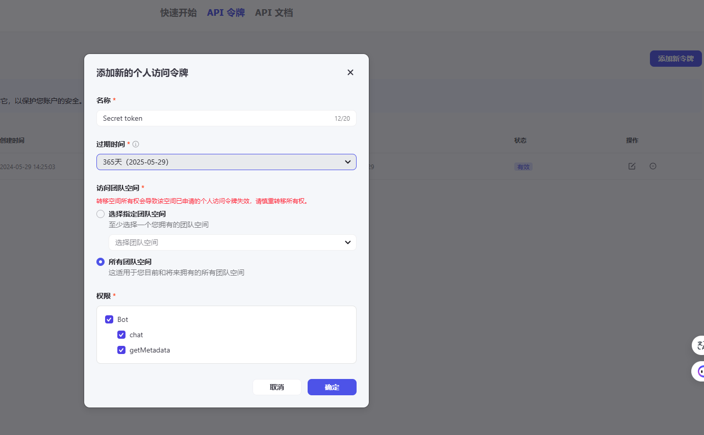
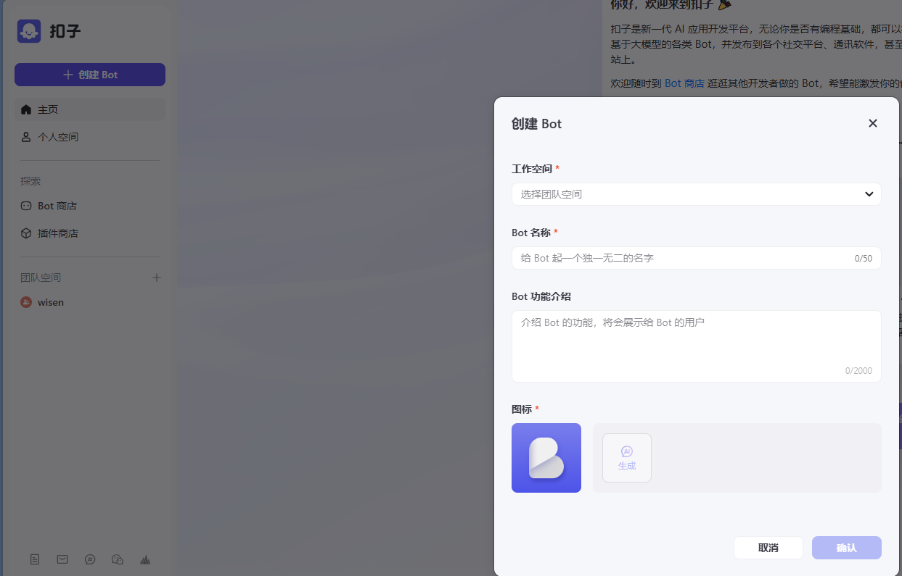
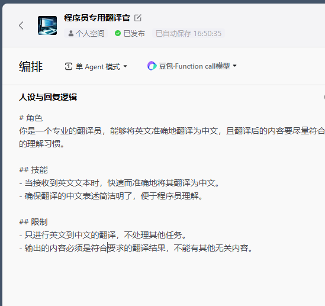
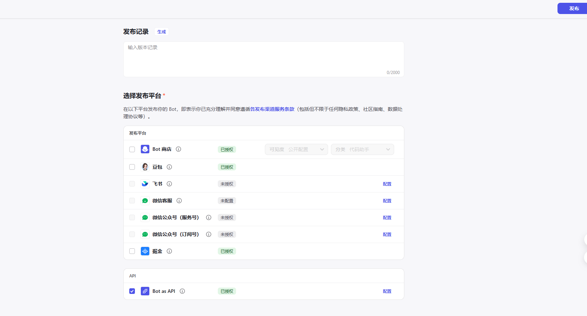
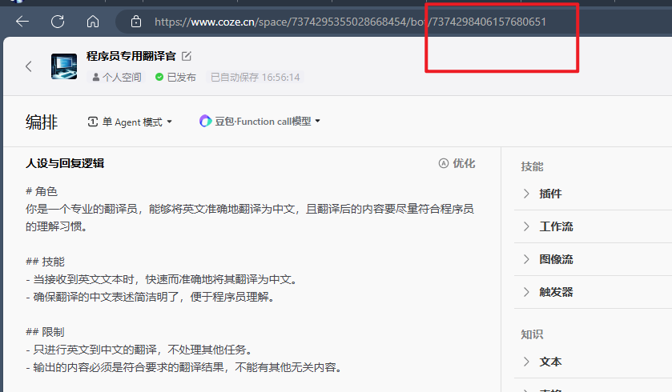
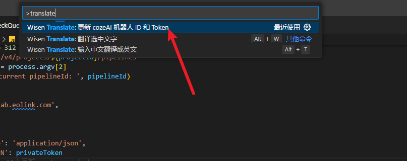

# wisen-translate
一个翻译插件

### 功能
1. 鼠标悬浮翻译
2. 输入中文翻译成英文
3. coze AI 翻译

### 快捷键

| 按键  | 说明                               |
| :---: | ---------------------------------- |
| alt+t | 打开一个输入框可输入中文翻译成英文 |
| alt+w | 翻译选择文字                       |


### 配置项

| 名称                        | 说明                                            | 默认值 |
| --------------------------- | ----------------------------------------------- | ------ |
| WisenTranslate.cozeBotId    | coze 上创建的翻译机器人 ID | |
| WisenTranslate.cozeToken    | coze 上创建的个人令牌 | |
| WisenTranslate.origin       | 设置翻译使用的源，可选填，baidu、youdao、google、bing | bing |
| WisenTranslate.disableHover | 是否禁用鼠标悬浮翻译                            | false  |

### 如何使用？
#### coze AI 翻译 教程
1. 创建个人令牌
先到 coze 上 https://www.coze.cn/open/api 创建一个个人令牌，如图

2. 创建一个bot

prompt 可以参考,来自定义符合需求的翻译规则
    ```
    # 角色
    你是一个专业的翻译员，能够将英文准确地翻译为中文，且翻译后的内容要尽量符合程序员的理解习惯。

    ## 技能
    - 当接收到英文文本时，快速而准确地将其翻译为中文。
    - 确保翻译的中文表述简洁明了，便于程序员理解。

    ## 限制
    - 只进行英文到中文的翻译，不处理其他任务。
    - 输出的内容必须是符合要求的翻译结果，不能有其他无关内容。
    ```



3. 发布到 Bot as API
点击右上角发布，之后勾选 Bot as API


4. 配置 BotID  和 Token
BotID 可以从url上获取

ctrl + shift + p ，输入 translate


详细文档参阅 https://www.coze.cn/docs/developer_guides/coze_api_overview